# AI-Powered Appointment Scheduler Assistant


This project implements **Problem Statement 1 – AI-Powered Appointment Scheduler Assistant**.

The goal of the system is to take **natural language appointment requests**, provided either as **typed text** or **noisy scanned images**, and convert them into **structured appointment data**.

The solution is designed as a **step-by-step backend pipeline** that includes OCR, text normalization, entity extraction, date/time normalization, and guardrails for ambiguity.


## What the System Does

Given inputs like:

* **Text input**
  `Book dentist next Friday at 3pm`
* **Image input (OCR)**
  `book dentist nxt Friday @ 3 pm`

The system extracts:

* Appointment department
* Date
* Time
* Timezone (Asia/Kolkata)

and returns a structured JSON response.

If the input is **ambiguous or incomplete**, the system safely exits with a clarification message instead of guessing.


## Architecture & Pipeline

The backend follows a clear and explainable pipeline:

```mermaid
flowchart LR
    Start([Start: Input Received]) --> InputCheck{Text / Image Input}
    
    InputCheck -->|Text| TextNorm[Text Normalization]
    InputCheck -->|Image| OCR[OCR Processing<br/>Extract text from image]
    
    OCR --> NoiseCheck{OCR Quality<br/>Check}
    NoiseCheck -->|Low Quality| NoiseHandling[Text Normalization<br/>Handle OCR noise & errors]
    NoiseCheck -->|Good Quality| NoiseHandling
    
    NoiseHandling --> Entity[Entity Extraction<br/>Identify key entities]
    TextNorm --> Entity
    
    Entity --> EntityFound{Entities<br/>Found?}
    EntityFound -->|Yes| DateTime[Date & Time Normalization<br/>]
    EntityFound -->|No| DateTime
    
    DateTime --> Guardrails[Apply Guardrails<br/> & Exit Condition]
    
    Guardrails --> GuardCheck{Pass<br/>Guardrails?}
    GuardCheck -->|Yes| Output([Final Output])
    GuardCheck -->|No| Error([Error/Rejection])
    
    style Start fill:#4CAF50,color:#fff
    style InputCheck fill:#2196F3,color:#fff
    style OCR fill:#FF9800
    style NoiseCheck fill:#2196F3,color:#fff
    style NoiseHandling fill:#FF9800
    style TextNorm fill:#FF9800
    style Entity fill:#9C27B0,color:#fff
    style EntityFound fill:#2196F3,color:#fff
    style DateTime fill:#9C27B0,color:#fff
    style Guardrails fill:#F44336,color:#fff
    style GuardCheck fill:#2196F3,color:#fff
    style Output fill:#4CAF50,color:#fff
    style Error fill:#F44336,color:#fff
```

Each stage produces intermediate outputs that are returned in the API response for transparency and easier debugging.


## AI Chaining

This system is AI-powered through **chained intelligent components**:

1. **OCR (Computer Vision)**
   Uses a machine-learning-based OCR engine (Tesseract) to extract text from scanned or noisy images.

2. **Natural Language Date Parsing**
   Relative date expressions like *“next Friday”* are resolved using NLP-based probabilistic date parsing.

3. **AI Chaining with Validation**
   Each stage (OCR, entity extraction, normalization) produces confidence scores, and decisions are made based on confidence.

4. **Guardrails for Ambiguity**
   If uncertainty remains after normalization, the system exits safely instead of producing unreliable results.


## Guardrails & Error Handling

The system returns a clarification response when:

* Date is missing or vague
* Time is missing
* Department is missing
* Normalization fails after best-effort cleanup

Example guardrail response:

```json
{
  "status": "needs_clarification",
  "message": "Ambiguous date/time or department"
}
```


## API Endpoint

### POST `/parse-appointment`

Accepts either text input or an image file.

#### Text Example

```bash
curl -X POST http://127.0.0.1:8000/parse-appointment \
-F "text=Book dentist next Friday at 3pm" | python3 -m json.tool
```
<table> <tr> <td></td> </tr> </table>

#### Image Example

```bash
curl -X POST http://127.0.0.1:8000/parse-appointment \
-F "image=@image2.png" | python3 -m json.tool
```
<table> <tr> <td></td> </tr> </table>


## Sample Successful Response

```json
{
  "ocr": {
    "raw_text": "book dentist next friday at 3pm",
    "confidence": 0.9
  },
  "entity_extraction": {
    "entities": {
      "date_phrase": "next friday",
      "time_phrase": "3pm",
      "department": "dentist"
    },
    "entities_confidence": 0.85
  },
  "normalization": {
    "normalized": {
      "date": "2026-01-23",
      "time": "15:00",
      "tz": "Asia/Kolkata"
    },
    "normalization_confidence": 0.9
  },
  "appointment": {
    "department": "Dentistry",
    "date": "2026-01-23",
    "time": "15:00",
    "tz": "Asia/Kolkata"
  },
  "status": "ok",
  "message": null
}
```

## Tech Stack

* Python 3.10+
* FastAPI
* Pydantic
* Tesseract OCR
* dateparser
* Pillow

## How to Run Locally

```bash
pip install -r requirements.txt
uvicorn app.main:app --reload
```

Open Swagger UI:

```
http://127.0.0.1:8000/docs
```

## Demo

A short screen recording is provided showing:
* Text input handling
* Noisy image OCR handling
* Guardrail behavior for ambiguous inputs

[](https://youtu.be/JtFmgAl4aMU)
